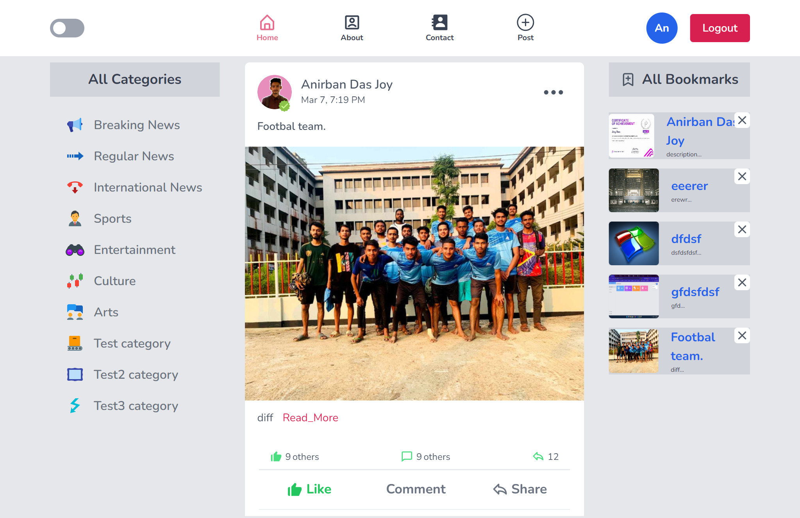

## NovaNexus Working On

### Project Overview
NovaNexus is a social news feed website. Through which people can share different types of news. You can delete and edit your post. If you want, you can save posts made by others. This website has an admin dashboard which only admin can access. There is an option to manage users and manage posted news from the dashboard. Admin can see all the information through the chart.



#### Visit the live site: [NovaNexus](https://novanexus.vercel.app)


### Key Features

- #### Like comment and share system on the news post :
  - There is a complete system to like, comment and share the posted news. Users must be logged in to the system to like, comment and share. There is a system to see how many likes and comments are read on a post and there 
    is a process to visit the profile of the user who has liked and commented. Users can share news posts on WhatsApp, Linkedin, Facebook and other social media if they want.

- #### The process of posting news and saving any post :
  - There is this system where users can post news if they want. There must be a login for that. And user can save any news. Later he can easily see the news.

 - #### User profile :
   - A user will have his own profile which he can visit himself or someone else. Users can set and update their own profile name, profile image, background image. The user's own posts will appear on his profile page.

 - #### Admin Dashboard :
   - There is a separate dashboard for admin. Admin can perform different functions including manage user manage news. Like he can verify any user if he wants. There is a system of removal. Anyone can remove news.
 


### Future plans
#### In this project I will use data structures and algorithms in the backend for performance optimization at the next stage. To make the operation of the website faster.

## Project Stacks

<p align="left">
  <a href="https://skillicons.dev">
    
  </a>
</p>

Download this project to your local computer:

```bash
git clone https://github.com/Anirbandasjoy/NovaNexus-Client.git
